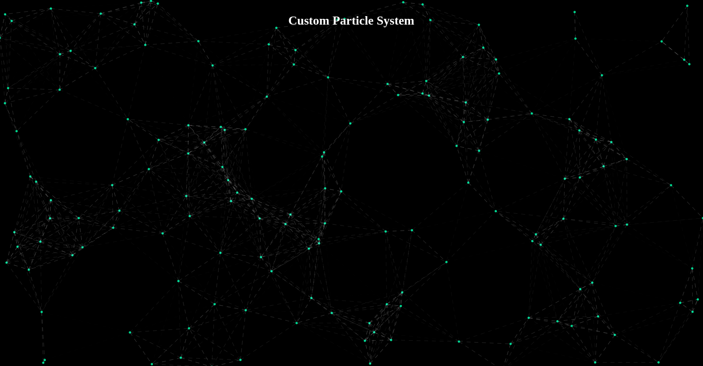

# Custom Particle System Documentation
A lightweight, modular particle system using HTML, CSS, and JavaScript, featuring moving, filled circular particles with customizable connecting lines (solid, dotted, dashed, dash-dotted). Configurable for count, size, color, speed, and line style, it integrates into backgrounds, Bootstrap cards, Semantic UI segments, or navbars with custom backgrounds and responsive design.


## Demos

Below are some demo images showcasing the particle system in action:

| Demo 1 | Demo 2 |
|--------|--------|
|  |  |

| Demo 3 | Demo 4 |
|--------|--------|
|  |  |


## Overview

This project provides a lightweight, modular, and customizable particle system built from scratch using HTML, CSS, and vanilla JavaScript. The system renders filled circular particles that move across a canvas and connect with lines when they are within a specified proximity. It is designed to be flexible, allowing you to integrate it into various contexts such as full-page backgrounds, Bootstrap cards, Semantic UI segments, or any other container. The particle system supports customization of particle count, size, color, line style, and more.

The project consists of two main files:
- [index.html](./index.html): The main HTML file that sets up the structure and initializes the particle system.
- [particles.js](./particles.js): The JavaScript file containing the `ParticleSystem` class that handles the particle animation logic.

## Features

- **Customizable Particles**: Adjust the number, size, color, and speed of particles.
- **Connecting Lines**: Particles connect with lines when they are within a specified distance, with options for solid, dotted, dashed, or dash-dotted lines.
- **Modular Design**: Can be integrated into any container (e.g., full-page background, Bootstrap card, Semantic UI segment).
- **Custom Background**: Set any background color, gradient, or image for the particle container.
- **Responsive**: Automatically resizes to fit its parent container.
- **Lightweight**: Built without external dependencies, optimized for performance using the canvas API and `requestAnimationFrame`.

## Installation

1. **Clone or Download the Project**:
   Clone the repository or download the files to your local machine.

2. **File Structure**:
   Ensure you have the following files in your project directory:
   - `index.html`: The main HTML file.
   - `particles.js`: The JavaScript file containing the `ParticleSystem` class.

3. **Open the Project**:
   Open `index.html` in a web browser to see the particle system in action. You can modify the initialization options in `index.html` to customize the particle system.

## Usage

The particle system is initialized by creating an instance of the `ParticleSystem` class and passing a canvas element along with an options object. The system can be integrated into various contexts by placing the canvas inside a container and ensuring proper positioning with CSS.

### Basic Initialization

To initialize the particle system, include the `particles.js` script and create a canvas element inside a container. Then, instantiate the `ParticleSystem` class with your desired options.

Example (from [index.html](./index.html)):
```html
<script>
    const container = document.getElementById("particle-container");
    const canvas = document.getElementById("particle-canvas");
    const particleSystem = new ParticleSystem(canvas, {
        numParticles: 100, // Number of particles
        maxDistance: 200, // Max distance for connecting lines
        particleRadius: 3, // Size of the filled dots
        particleColor: "rgba(234, 170, 22, 0.8)", // Color of the dots
        lineColor: "rgba(255, 255, 255, 0.4)", // Color of the lines
        speed: 3, // Speed of particle movement
        lineType: "dashed" // Type of connecting lines
    });
    particleSystem.start();
</script>
```

### Configuration Options

The `ParticleSystem` class accepts an options object with the following properties:

| Option           | Description                                      | Default Value                     | Example Value                     |
|------------------|--------------------------------------------------|-----------------------------------|-----------------------------------|
| `numParticles`   | Number of particles (also referred to as "amount") | `50`                              | `100`                             |
| `maxDistance`    | Max distance for connecting lines (also referred to as "proximity") | `100`                             | `200`                             |
| `particleRadius` | Radius of the filled dots                        | `2`                               | `3`                               |
| `particleColor`  | Color of the dots (supports any valid CSS color) | `"rgba(255, 255, 255, 0.8)"`     | `"rgba(234, 170, 22, 0.8)"`      |
| `lineColor`      | Color of the connecting lines                    | `"rgba(255, 255, 255, 0.3)"`     | `"rgba(255, 255, 255, 0.4)"`     |
| `speed`          | Speed of particle movement                       | `1`                               | `3`                               |
| `lineType`       | Type of connecting lines ("solid", "dotted", "dashed", "dash-dotted") | `"solid"`                         | `"dashed"`                        |

### Examples of Integration

The particle system is designed to be modular and can be integrated into various contexts. Below are examples of how to use it in different scenarios.

#### 1. Full-Page Background

The default setup in [index.html](./index.html) uses the particle system as a full-page background. The container is set to `100vh` to fill the viewport, and the canvas is positioned absolutely to cover the entire container.

CSS for the container:
```
.particle-container {
    position: relative;
    width: 100%;
    height: 100vh;
    overflow: hidden;
    background: #000; /* Custom background color */
}
```

#### 2. Bootstrap Card

To add the particle system to a Bootstrap card, include Bootstrap’s CSS, create a card with a `position: relative` container, and initialize the particle system inside it.

Example:
```html
<link href="https://cdn.jsdelivr.net/npm/bootstrap@5.3.0/dist/css/bootstrap.min.css" rel="stylesheet">

<div class="container my-5">
    <div class="card particle-container" id="particle-card" style="height: 300px;">
        <canvas id="particle-canvas-card"></canvas>
        <div class="card-body content">
            <h5 class="card-title">Particle Card</h5>
            <p class="card-text">This card has a particle background!</p>
        </div>
    </div>
</div>

<script src="particles.js"></script>
<script>
    const cardCanvas = document.getElementById("particle-canvas-card");
    const cardParticleSystem = new ParticleSystem(cardCanvas, {
        numParticles: 50,
        maxDistance: 100,
        particleRadius: 2,
        particleColor: "rgba(234, 170, 22, 0.8)",
        lineColor: "rgba(255, 255, 255, 0.4)",
        speed: 0.5,
        lineType: "dotted"
    });
    cardParticleSystem.start();
</script>
```

#### 3. Semantic UI Segment

To add the particle system to a Semantic UI segment, include Semantic UI’s CSS, create a segment with a `position: relative` container, and initialize the particle system inside it.

Example:
```html
<link rel="stylesheet" href="https://cdn.jsdelivr.net/npm/semantic-ui@2.5.0/dist/semantic.min.css">

<div class="ui container" style="margin-top: 50px;">
    <div class="ui segment particle-container" id="particle-segment" style="height: 300px;">
        <canvas id="particle-canvas-segment"></canvas>
        <div class="content">
            <h3 class="ui header">Particle Segment</h3>
            <p>This segment has a particle background!</p>
        </div>
    </div>
</div>

<script src="particles.js"></script>
<script>
    const segmentCanvas = document.getElementById("particle-canvas-segment");
    const segmentParticleSystem = new ParticleSystem(segmentCanvas, {
        numParticles: 60,
        maxDistance: 150,
        particleRadius: 2.5,
        particleColor: "rgba(234, 170, 22, 0.8)",
        lineColor: "rgba(255, 255, 255, 0.4)",
        speed: 1,
        lineType: "dash-dotted"
    });
    segmentParticleSystem.start();
</script>
```

#### 4. Navbar Background

To add the particle system to a navbar (e.g., a Bootstrap navbar), set the navbar as the container and initialize the particle system inside it.

Example:
```html
<link href="https://cdn.jsdelivr.net/npm/bootstrap@5.3.0/dist/css/bootstrap.min.css" rel="stylesheet">

<nav class="navbar navbar-expand-lg navbar-dark particle-container" id="particle-navbar" style="height: 60px;">
    <canvas id="particle-canvas-navbar"></canvas>
    <div class="container-fluid content">
        <a class="navbar-brand" href="#">Particle Navbar</a>
        <button class="navbar-toggler" type="button" data-bs-toggle="collapse" data-bs-target="#navbarNav">
            <span class="navbar-toggler-icon"></span>
        </button>
        <div class="collapse navbar-collapse" id="navbarNav">
            <ul class="navbar-nav">
                <li class="nav-item">
                    <a class="nav-link" href="#">Home</a>
                </li>
                <li class="nav-item">
                    <a class="nav-link" href="#">About</a>
                </li>
            </ul>
        </div>
    </div>
</nav>

<script src="particles.js"></script>
<script>
    const navbarCanvas = document.getElementById("particle-canvas-navbar");
    const navbarParticleSystem = new ParticleSystem(navbarCanvas, {
        numParticles: 30,
        maxDistance: 80,
        particleRadius: 1.5,
        particleColor: "rgba(234, 170, 22, 0.8)",
        lineColor: "rgba(255, 255, 255, 0.4)",
        speed: 0.3,
        lineType: "solid"
    });
    navbarParticleSystem.start();
</script>
```

### Customizing the Background

The background of the particle system is set via the CSS of the `.particle-container`. You can use a solid color, gradient, or image.

Example with a gradient background:
```css
.particle-container {
    background: linear-gradient(45deg, #000, #333);
}
```

Example with an image background:
```css
.particle-container {
    background: url('background.jpg') no-repeat center center/cover;
}
```

### Methods

The `ParticleSystem` class provides the following methods:

- `start()`: Starts the particle animation.
- `stop()`: Stops the particle animation.

Example:
```js
const particleSystem = new ParticleSystem(canvas, { /* options */ });
particleSystem.start(); // Start the animation
particleSystem.stop();  // Stop the animation
```

## Performance Considerations

- **Particle Count**: Keep `numParticles` reasonable (e.g., 50–100 for most use cases) to avoid performance issues, especially on low-end devices.
- **Canvas Size**: The system automatically resizes to fit its container, but large canvases with many particles may impact performance.
- **Line Connections**: The number of lines increases quadratically with the number of particles, so adjust `maxDistance` to control the density of connections.

## Browser Compatibility

The particle system uses the HTML5 Canvas API and `requestAnimationFrame`, which are supported in all modern browsers (Chrome, Firefox, Safari, Edge, etc.).

## License

This project is open-source and available under the MIT License. Feel free to use, modify, and distribute it as needed.

## Contributing

Contributions are welcome! If you have ideas for new features (e.g., interactivity, particle shapes, or color variations), feel free to submit a pull request or open an issue on the repository.
